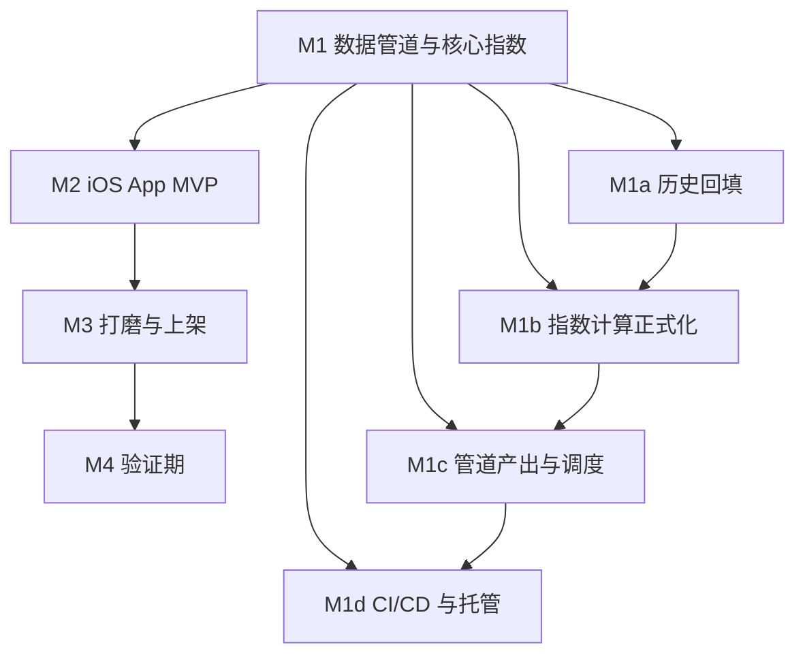

# 恐慌指数 — 系统设计与任务分解 (SDD / WBS)

> 本文件是持续维护的设计 + 任务文档。方案背景与可行性见 [`../one-pager.md`](../one-pager.md)。
> 状态图例：`[ ]` 未开始 · `[~]` 进行中 · `[x]` 已完成

日期：2026-07-21 起 · 范围：M1 数据管道与核心指数（深拆）+ M2–M4 骨架

---

## 0. 架构总览

```
① 算 (GitHub Actions 临时容器, cron 错峰)
   Python + AKShare/CNN → 分位合成 → index.json
        │ commit / upload
        ▼
② 存 (静态托管: raw.githubusercontent, max-age=300, 见 2.7)
        │ HTTPS GET (CDN 缓存)
        ▼
③ 取 (iOS App: SwiftUI + WidgetKit, 无后端, 只消费一个 JSON)
```

设计原则：无服务器、零月费、客户端极薄。所有指数计算在管道完成。

---

## 1. 全局任务骨架 (M1 → M4)



- **M1 数据管道与核心指数**（本文件深拆）— 唯一护城河，最先做。
- **M2 iOS App MVP** — SwiftUI 仪表盘 + Small/Medium Widget + App Group 缓存 + 消费 index.json。验收：真机能显示双市场当前值。
- **M3 打磨与上架** — 历史图表(Swift Charts)、锁屏组件、Tip Jar(StoreKit2)、中英素材、过审。验收：上架美区/港区。
- **M4 验证期** — TestFlight + 正式版，收集 7 日留存 / 自然传播 / 自用 三项指标，4 周后决定是否备案进中国区。

---

## 2. 当前节点深拆：A股核心指数算法 + 数据管道 (M1)

### 2.0 现状基线（已完成）
- `pipeline/fetch_cnn.py` — CNN 抓取，已跑通（当前值 + 90 天历史）。
- `pipeline/fetch_cn.py` — 七因子取数 + 加权合成，实跑覆盖率 100%，含多源容错。
- `pipeline/index_utils.py` — 分位归一化 (`percentile_score`) + 打标签 (`label_for`)。
- `pipeline/main.py` — 编排产出 `out/index.json` + `out/report.json`。
- 环境：`.venv312`（uv 装的独立 Python 3.12；系统仅 3.9，不满足最新 akshare）。

**核心缺口**：`breadth`/`limit_sentiment` 为当日快照（分位窗口=0）、`leverage` 历史仅 22 天、`cn.history` 为空。→ M1a 解阻塞。

### 2.1 因子定义与权重（启发式，v1）

| 因子 | 定义 | 权重 | 方向 |
|---|---|---|---|
| breadth 市场广度 | 沪深涨跌家数比（5 日平滑） | 20% | 正 |
| limit_sentiment 涨跌停 | 涨停 /(涨停+跌停) | 15% | 正 |
| momentum 指数动量 | 沪深300 相对 125 日均线偏离 | 20% | 正 |
| turnover 成交热度 | 两市成交额 / 60 日均值 | 15% | 正 |
| high_low 新高新低 | 净新高（近似 52 周） | 10% | 正 |
| leverage 杠杆情绪 | 融资余额 5 日变化率 | 10% | 正 |
| volatility 波动率 | QVIX（`index_option_50etf_qvix`） | 10% | 反 |

归一化：每因子先算 rolling 2 年历史分位（0–100），反向因子取 `100 - 分位`，再按权重合成；缺失因子按现有权重归一化降级。权重为启发式，App 内如实标注，后续按回测校准。

### 2.2 M1a 历史回填（最高优先级）

逐因子数据源与回填策略（2026-07-21 `probe_sources.py` 实测确认）：

- **涨跌停** `limit_sentiment`：⚠️ 实测 `stock_zt_pool_dtgc_em`（跌停池）**只提供最近约 30 交易日**（更早抛 `ValueError`）。→ 无法回填 2 年，**降为 go-forward 因子**（现只 seed 最近约 30 天，逐日累积）。回填由新到旧、命中上限即停。
- **市场广度** `breadth`：❌ 确认无历史接口（`stock_market_activity_legu` 仅快照）。**决策：go-forward 每日累积快照入库**；后续如需历史可再用全A日线批量重建。
- **go-forward 因子的降级**：`breadth` 与 `limit_sentiment` 在窗口 < 60 日前标 `low_confidence` 并按权重重分配，不阻塞其余 5 个有 2 年历史的因子（合成从第一天即可用，约 65% 覆盖，约 60 交易日后升至 100%）。
- **动量 / 成交** `momentum`/`turnover`：✅ `index_zh_a_hist(000300)` 有多年历史；东财偶发断连 → 必须带重试 + 新浪 `stock_zh_index_daily` 兜底（已实测有效）。
- **新高新低** `high_low`：✅ `stock_a_high_low_statistics(all)` 一次返回 500 行、覆盖 2024-06→2026-07（满 2 年），含 high120/low120。
- **杠杆** `leverage`：✅ `stock_margin_sse` 一次调用返回 504 行满 2 年（沪市，`信用交易日期`+`融资余额`）。深市 `stock_margin_szse` 为可选增强（本次瞬时断连，需重试）。
- **波动率** `volatility`：✅ QVIX `index_option_50etf_qvix` 一次返回 2771 行（2015→2026）。

- 落地存储：`pipeline/data/factors.db`（SQLite），一因子一表（见 2.5 schema）。
- 回填脚本 `pipeline/backfill.py`：交易日循环 + 限频 sleep + 重试（网络错误退避、`ValueError` 不重试）+ 断点续跑（已入库日期跳过）；产出每因子覆盖率报告。
- **验收（实际达成）**：5 个因子有 2 年+ 历史（momentum/turnover 十余年、volatility 2015 起、high_low 500 日、leverage 587 日）；2 个 go-forward 因子（breadth/limit_sentiment）有明确记录与降级说明。

### 2.3 M1b 指数计算正式化
- 分位数改为读取 `factors.db`（rolling 2 年），替换现有快照线性映射。
- 加权合成 + 缺失降级（保留现逻辑，补单元测试覆盖 `percentile_score`/`label_for`/`compose`）。
- 冷启动/异常/stale 规则成文：历史 < N 日的因子标 `low_confidence`，不参与或降权。
- **验收**：`out/index.json` 的 `cn.history` 能产出近 90 天日频序列；用历史大跌/大涨日目视对照合理。

### 2.4 M1c 管道产出与调度
- 定稿 `index.json` schema（补齐 `cn.prev_close/week_ago/history`），与 iOS 端字段对齐。
- 错峰调度：A股盘中（09:30–15:00 CST）每 30–60 分钟刷宽度/动量/成交；盘后日结；美股时段（约 21:30–05:00 CST）刷 CNN。写成 cron 规格。
- 数据质量告警：抓取失败、因子缺失、数值越界 → 日志 + `stale`/`low_confidence` 标记。
- **验收**：单文件 < 50KB，字段与 one-pager 2.2 节 JSON 一致。

### 2.5 存储 schema（SQLite）

```
每因子一表，统一结构：
CREATE TABLE factor_<name> (
  trade_date TEXT PRIMARY KEY,   -- YYYY-MM-DD
  raw_value  REAL NOT NULL,      -- 因子原始值
  updated_at TEXT NOT NULL       -- 入库时间
);
-- 元数据表记录每因子回填覆盖情况
CREATE TABLE meta (
  factor TEXT PRIMARY KEY,
  first_date TEXT, last_date TEXT, rows INTEGER, note TEXT
);
```

### 2.6 M1d CI/CD 与静态托管（接法 A 优先）
- `.github/workflows/pipeline.yml`：cron 错峰（07:35 UTC A股盘后 / 22:05 UTC 美股盘后）→ setup-python 3.12 → 装依赖 → `python main.py` → commit `pipeline/out/index.json` + `pipeline/data/factors.db` 回仓库。
- `factors.db` 一并提交：保留 go-forward 因子（breadth/limit_sentiment）的每日累积，避免重建丢失。
- 保活：每日 commit 天然规避「公开仓库 60 天无活动自动禁用」。
- **验收（已达成）**：仓库 `github.com/quanxiaole/finapp` 已上线，CI 按 cron 自动运行并提交（已观察到 7 次 `data: 自动更新 index.json`）。

### 2.7 数据分发 URL（M2-1 决策）

**生产 URL（客户端使用）**：

```
https://raw.githubusercontent.com/quanxiaole/finapp/main/fear-greed/pipeline/out/index.json
```

选型依据（实测 `curl -I`）：

| 方案 | cache-control | 结论 |
|---|---|---|
| raw.githubusercontent.com | `max-age=300`（5 分钟） | ✅ 采用，TTL 远小于 30 分钟刷新间隔 |
| jsDelivr `@main` | `max-age=604800` + `s-maxage=43200` | ❌ 客户端缓存 7 天，小组件会长期显示过期数据 |
| GitHub Pages | 短 TTL，正规静态托管 | 可选升级（需在仓库 Settings 手动开启） |

注：目录已由 `Fear & Greed` 改名为 `fear-greed`（M2-0），避免 URL 出现 `%20%26` 转义。

---

## 3. iOS App MVP (M2)

### 3.1 分层与取舍

```
FearGreedCore (SwiftPM)      模型 / 防御式解码 / 展示格式化 / 端点常量
        ▲
FearGreedUI   (SwiftPM)      IndexRepository + App Group 缓存 + SwiftUI 视图 + WidgetKit
        ▲                    （App 与 Widget Extension 共用）
   ┌────┴────┐
App target   Widget target   只放 @main，各约 10 行
```

**关键决策：业务代码全部放 SwiftPM 包，Xcode target 只留 `@main`。**
直接收益是本机（只有 Command Line Tools、无 Xcode）就能编译、跑单测、把界面渲染成
PNG 看效果；Xcode 仅在跑模拟器和上架时才必需。代价是 Xcode 里多一步添加本地包依赖。

### 3.2 数据流与降级

```
raw.githubusercontent (max-age=300)
   │ URLSession，15s 超时，reloadRevalidatingCacheData 走 ETag
   ▼
IndexRepository ──成功──▶ 写 App Group 共享缓存 ──▶ App / Widget
   └──失败──▶ 读共享缓存 ──▶ 标记 isFromCache + 失败原因
              └──无缓存──▶ SnapshotLoadError.offlineWithoutCache（空态 + 重试按钮）
```

三层降级都有单测覆盖：网络失败回退缓存、坏 JSON 回退缓存、首启无缓存才报错。

### 3.3 小组件

| 组件 | 尺寸 | 内容 |
|---|---|---|
| `CNIndexWidget` | Small | A股仪表盘 + 较昨收 |
| `USIndexWidget` | Small | 美股仪表盘 + 较昨收 |
| `DualMarketWidget` | Medium | 双市场并排 + 各自 7 日趋势 |

三个静态组件而非一个可配置组件：MVP 省掉 AppIntent 配置界面，用户在组件库直接挑。
时间线策略 `.after(30 分钟)` ≈ 48 次/天，落在系统 40–70 次预算内（系统仍会按电量节流，
是「不早于」而非精确定时）。

### 3.4 无 Xcode 的验收手段

- `swift test` — 41 个单测（解码 / 展示格式化 / 数据层 / ViewModel / 时间线）。
- `tools/RenderPreview` — 用 `ImageRenderer` 把视图离屏渲染成 PNG，无需模拟器。
  已借此发现并修掉两个真实布局缺陷：仪表指针横穿数字（改为弧上圆点）、
  走势线固定 0–100 量程被压成直线（改为自适应量程）。

详细建工程步骤见 [`../ios/README.md`](../ios/README.md)。

### 3.5 模拟器实跑验收（已完成）

Xcode 26.6 / iOS 26.5 模拟器，`xcodebuild` 构建两个 target 零报错零警告，实测：

- 主 App 显示美股 39「恐慌」/ A股 16「极度恐慌」，与线上 index.json 一致；
- 首次安装无本地缓存即能取数，证明 URLSession → raw.githubusercontent 链路通；
- `Containers/Shared/AppGroup/<id>/index_snapshot.json` 已生成，证明 App Group
  entitlement 生效且共享缓存写入正常；
- `FearGreedWidget.appex` 正确嵌入 `PlugIns/`，扩展点 `com.apple.widgetkit-extension`。

### 3.6 已知限制

- **真机需付费账号**：App Group 在模拟器免费可用，真机签名需 $99 开发者账号（M3/M4）。
- **组件刷新非精确**：`.after` 只保证不早于，系统按电量与使用频率节流。
- **A股低置信提示会持续存在**：`coverage` 目前 0.65，因 `breadth` / `limit_sentiment`
  只能向前累积历史，满两年前 UI 会一直显示「因子覆盖 65%」。
- **未做 App 图标与资源目录**：MVP 阶段无 asset catalog，主屏图标为默认白底（M3 补）。

---

## 4. 不在当前范围
- Swift Charts 历史图表、锁屏 accessory 组件、Tip Jar、上架素材（M3）。
- 港股、APNs 推送（Phase 2）。
- 权重回测调参（v1 用启发式，M1b 仅做合理性校验，不做最优化）。

## 5. 任务清单（对应 plan todos）
- [x] M1a 逐因子数据源与回填可行性核实（`probe_sources.py`）
- [x] M1a SQLite 存储 schema（`storage.py`）
- [x] M1a backfill.py + 回填（5 因子 2 年+；breadth/limit go-forward）
- [x] M1b 分位数改读回填库 + 测试（`compute.py` + `test_compute.py` 5/5）
- [x] M1b 产出 cn.history 90 天 + 合理性校验（`validate.py`，corr=+0.78）
- [x] M1c index.json schema + 错峰调度 + 数据质量告警（`main.py`）
- [x] M1d GitHub Actions + 静态托管（`.github/workflows/pipeline.yml`，本地验收通过）
- [x] M2-0 目录改名 `Fear & Greed` → `fear-greed` + CI 路径同步
- [x] M2-1 分发 URL 定型（raw，`max-age=300`，见 2.7）
- [x] M2a 核心层 `FearGreedCore` + 22 个单测
- [x] M2c `IndexRepository` + App Group 共享缓存 + 三层降级
- [x] M2d SwiftUI 双市场仪表盘 + 下拉刷新 + `reloadAllTimelines`
- [x] M2e WidgetKit Small×2 / Medium×1 + `.after(30min)` 时间线
- [x] M2b Xcode 工程（App + Widget Extension + App Group + 本地包），模拟器实跑通过
- [ ] 把小组件加到主屏验收 — 需手工 3 步（见 [`../ios/README.md`](../ios/README.md)）

## 6. 模块索引
- `pipeline/storage.py` — SQLite 存储（一因子一表 + meta）
- `pipeline/net.py` — 网络重试（网络错误退避、ValueError 不重试）
- `pipeline/factor_defs.py` — 因子原始值单一定义源（回填/实时共用）
- `pipeline/backfill.py` — 历史回填（限频/重试/断点续跑/go-forward）
- `pipeline/compute.py` — as-of 滚动分位合成引擎
- `pipeline/fetch_cnn.py` — CNN Fear & Greed 抓取
- `pipeline/main.py` — 生产入口（增量→合成→index.json + 质量报告）
- `pipeline/validate.py` — 指数合理性校验
- `pipeline/test_compute.py` — 单元测试
- `pipeline/probe_sources.py` — 数据源可行性探测

iOS：

- `ios/FearGreedCore/Sources/FearGreedCore/` — 模型、防御式解码、展示格式化、端点常量
- `ios/FearGreedCore/Sources/FearGreedUI/` — 数据层（`IndexRepository` / `SnapshotCache`）、
  视图（`DashboardView` / `MarketCardView` / `GaugeView` / `SparklineView`）、
  小组件（`Widgets` / `WidgetTimeline` / `WidgetViews`）
- `ios/App/`、`ios/Widget/` — 两个 Xcode target 的 `@main` 入口
- `ios/tools/RenderPreview/` — 离屏渲染 PNG 的开发期工具
